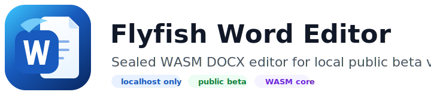

<p align="center">
  <a href="https://docx-editor.pages.dev/">
    
  </a>
</p>

<h1 align="center">Flyfish Word Editor</h1>

<p align="center">
  <strong>面向浏览器应用的专业 DOCX 编辑器，本仓库提供 localhost-only WASM 公测展开版。</strong>
</p>

<p align="center">
  <a href="https://docx-editor.pages.dev/">官网</a> ·
  <a href="https://docx-editor.pages.dev/examples/demo/">在线 Demo</a> ·
  <a href="https://docx-editor.pages.dev/examples/integration/">集成 Demo</a> ·
  <a href="https://docx-editor.pages.dev/docs/">文档</a> ·
  <a href="https://docx-editor.pages.dev/downloads/word-editor-public-beta.zip">下载公测包</a> ·
  <a href="https://github.com/flyfish-dev/word-editor/issues/new/choose">反馈样例和问题</a> ·
  <a href="https://dev.flyfish.group/shop">飞鱼小铺</a>
</p>

<p align="center">
  <a href="README.md">简体中文</a> · <a href="README.en.md">English</a>
</p>

<p align="center">
  <a href="https://github.com/flyfish-dev/word-editor"></a>
  
  
  
  
  <a href="https://docx-editor.pages.dev/"></a>
  <a href="https://dev.flyfish.group/shop"></a>
</p>

---

## 项目定位

Flyfish Word Editor 是飞鱼开源工作室面向业务系统、OA、合同、知识库、审批和私有化交付场景打造的浏览器端 DOCX 编辑器。

这个公开仓库直接放置展开后的免费公测 WASM Demo，用于体验产品，并通过 GitHub Issues 收集真实样例、兼容性问题、产品建议和购买意向。

> 本仓库不是完整源码仓库。仓库中的 HTML/JS 只是本地服务和加载逻辑；核心编辑器运行时代码封装在 `wasm/word-editor-local-core.wasm` 中。

## 快速体验

```bash
git clone https://github.com/flyfish-dev/word-editor.git
cd word-editor
node serve-localhost.mjs
```

打开：

```text
http://127.0.0.1:8789/
```

当前展开版：

```text
brand: Flyfish Word Editor
buildId: local-wasm-20260717034737
payloadSha256: 35bdaae03f5dfaa28178c4b4ac49f9d15336be72957f27c84a4fd6be778e8430
有效期: 2026-07-31T03:47:42.000Z
允许访问: http://127.0.0.1:* / http://localhost:*
```

## 官方入口

| 入口 | 地址 |
| --- | --- |
| 官网 | [docx-editor.pages.dev](https://docx-editor.pages.dev/) |
| 在线 Demo | [docx-editor.pages.dev/examples/demo](https://docx-editor.pages.dev/examples/demo/) |
| 第三方集成 Demo | [docx-editor.pages.dev/examples/integration](https://docx-editor.pages.dev/examples/integration/) |
| 文档 | [docx-editor.pages.dev/docs](https://docx-editor.pages.dev/docs/) |
| 公测仓库 | [github.com/flyfish-dev/word-editor](https://github.com/flyfish-dev/word-editor) |
| 下载公测包 | [docx-editor.pages.dev/downloads/word-editor-public-beta.zip](https://docx-editor.pages.dev/downloads/word-editor-public-beta.zip) |
| 飞鱼小铺 | [dev.flyfish.group/shop](https://dev.flyfish.group/shop) |

## 购买与合作

- 购买意向联系：[提交购买咨询 Issue](https://github.com/flyfish-dev/word-editor/issues/new?template=purchase-intent.yml)
- 购买链接：[进入飞鱼小铺](https://dev.flyfish.group/shop)
- 产品问题和样例反馈：[提交问题或样例](https://github.com/flyfish-dev/word-editor/issues/new/choose)

购买咨询请尽量说明使用场景、部署方式、预计用户规模、是否需要私有化/离线授权、是否需要定制功能或技术支持。

## 联系与支持

| 客服微信 | 微信公众号 | 用户交流群 | 微信赞赏 | 支付宝支持 |
| --- | --- | --- | --- | --- |
|  |  |  |  |  |

支持优先级建议：

- 公开 Bug、兼容性样例、产品建议：优先提交 [GitHub Issue](https://github.com/flyfish-dev/word-editor/issues/new/choose)。
- 商用授权、私有化部署、OEM、定制功能：提交 [购买咨询 Issue](https://github.com/flyfish-dev/word-editor/issues/new?template=purchase-intent.yml) 或通过客服微信沟通。
- 希望支持项目持续迭代：可进入 [飞鱼小铺](https://dev.flyfish.group/shop)，或使用上方赞赏码。

## 品牌与标识

官方品牌名：

```text
Flyfish Word Editor
中文口径：飞鱼 Word Editor
仓库名：flyfish-dev/word-editor
```

品牌资产：

| 类型 | 文件 |
| --- | --- |
| 横版 Logo | `assets/brand/flyfish-word-editor-logo.svg` |
| 方形 Mark | `assets/brand/flyfish-word-editor-mark.svg` |
| 公测 Badge | `assets/brand/flyfish-word-editor-public-beta-badge.svg` |
| 社交预览图 | `.github/social-preview.svg` |

README badge 口径：

- `public beta`: 展开版公测仓库。
- `runtime`: 核心以 sealed WASM 形式加载。
- `access`: 仅允许 `localhost` / `127.0.0.1`。
- `source maps`: 不发布 sourcemap。
- `core payload`: 核心 payload 已封装。

## 反馈样例与问题

欢迎通过 Issues 帮助我们完善产品：

- 上传无法正确打开、渲染或保存的 DOCX 样例。
- 描述 Word、WPS、OnlyOffice 或 Word Online 中的正确效果。
- 提供截图、录屏、浏览器版本、系统版本和复现步骤。
- 标注是否包含隐私、合同、客户数据或受版权保护内容。

请勿上传未脱敏的敏感文件。若样例无法公开，请先创建 Issue 描述问题，我们会沟通安全提交方式。

## 公测约束

- 仅用于免费本地体验和问题反馈。
- 只允许 `localhost` / `127.0.0.1` 访问。
- 不要部署到公网服务器。
- 不包含完整源码，也不授予反编译、破解授权门禁或绕过访问限制的许可。

## 仓库内容

```text
index.html
local-wasm-loader.mjs
serve-localhost.mjs
office-preview-license.json
word-editor-local-wasm-release.json
auth/word-editor-license-runtime.mjs
wasm/office-parser-core.wasm
wasm/word-editor-local-core.wasm
test-fixtures/docx/simple.docx
assets/brand/
assets/support/
.github/ISSUE_TEMPLATE/
```

## 状态

当前为公开公测阶段。我们会根据 Issues 中的真实文档样例和问题报告持续更新 WASM 展开版、在线 Demo 和正式产品。
